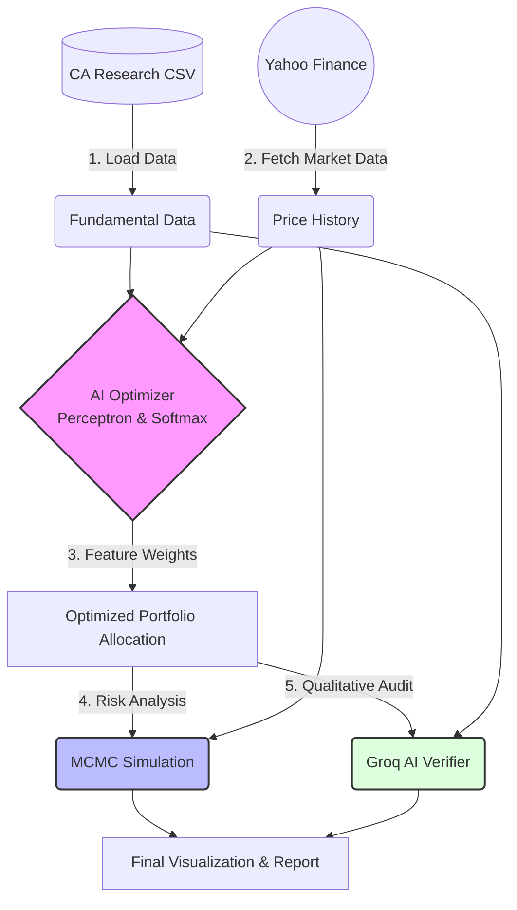

# CBS Finance Challenge: AI-Quant Pipeline


A cutting-edge, quantitative finance pipeline built for the **CBS Finance Challenge**. This project bridges the gap between traditional Chartered Accountant (CA) fundamental research and advanced Machine Learning portfolio optimization.

## 🚀 Intuition & Overview

Traditional portfolio management often relies heavily on human intuition when balancing fundamentals (like ROE, PE) against market volatility. 

This project removes the guesswork by introducing an **AI-driven Perceptron Optimizer**. Instead of directly optimizing weights like classic Markowitz models, our Neural Network learns the *importance* of underlying fundamental features (ROE, PE, Expected Upside) and dynamically maps them to optimal portfolio weights using a Softmax layer. 

The pipeline ensures maximum Sharpe Ratio while strictly adhering to real-world constraints (e.g., max 20% allocation per asset). The generated portfolio is then rigorously stress-tested using **Markov Chain Monte Carlo (MCMC)** simulations and vetted by a **Groq AI** agent for qualitative sanity checking.

---

## 🧠 System Architecture

The pipeline operates in a sequential, 6-step architecture:



---

## 🛠️ Key Features

1. **Fundamental Data Integration:** Seamlessly ingests CA-provided metrics (ROE, PE, Target Prices).
2. **AI Perceptron Optimizer:** A custom neural network layer that maps Z-score normalized fundamentals to portfolio weights. It enforces logic constraints:
   - Rewards high ROE and Expected Upside.
   - Penalizes high PE ratios.
3. **MCMC Risk Simulation:** Runs 10,000 Monte Carlo trajectories to forecast the 1-year Expected Value and the 95% Confidence Worst-Case scenario (Value at Risk).
4. **LLM Sanity Check:** Integrates Groq's fast LLM API to provide real-time qualitative narratives on the AI's quantitative choices.
5. **Rich CLI Interface:** Beautiful terminal UI built with `Typer` and `Rich` for a professional execution experience.
6. **Automated Visualizations:** Automatically generates and exports:
   - Correlation Matrices
   - Efficient Frontiers
   - Monte Carlo Price Paths
   - Asset Allocation Pie Charts

---

## 💻 Installation

1. **Clone the repository:**
   ```bash
   git clone https://github.com/yourusername/CBSFinanceChallenge.git
   cd CBSFinanceChallenge
   ```

2. **Set up the virtual environment:**
   Using `uv` (recommended) or `pip`:
   ```bash
   # If using uv
   uv sync
   
   # Or standard pip
   pip install -r requirements.txt
   ```

3. **Environment Variables:**
   Create a `.env` file in the root directory and add your Groq API key:
   ```env
   GROQ_API_KEY=your_groq_api_key_here
   ```

4. **Prepare Data:**
   Ensure `data/stock_universe.csv` exists with the CA research data.

---

## 🏃‍♂️ Usage

Run the full pipeline using the CLI:

```bash
python main.py run-analysis
```

You will see a beautifully formatted terminal output detailing the data loading, market syncing, AI optimization (with feature influence weights), MCMC expected values, and the Groq AI qualitative audit.

All generated charts will be saved in the `output/` directory.

---

## 📊 Technical Deep Dive: The AI Optimizer

The core of the strategy lies in `src/ai_optimizer.py`. 

Instead of traditional Mean-Variance Optimization, we optimize a weight vector $\theta$ representing the importance of our features (ROE, PE, Upside).
The portfolio weights $W$ are calculated as:

$W = Softmax(X \cdot \theta_{features} + \theta_{bias})$

Where $X$ is the standardized feature matrix. The loss function minimizes the **Negative Sharpe Ratio** while applying a stiff penalty if any single asset's weight exceeds 20%. The optimizer uses SLSQP (Sequential Least Squares Programming) with strict bounds to ensure the AI doesn't "cheat" (e.g., it is forced to treat high PE as a negative trait).
